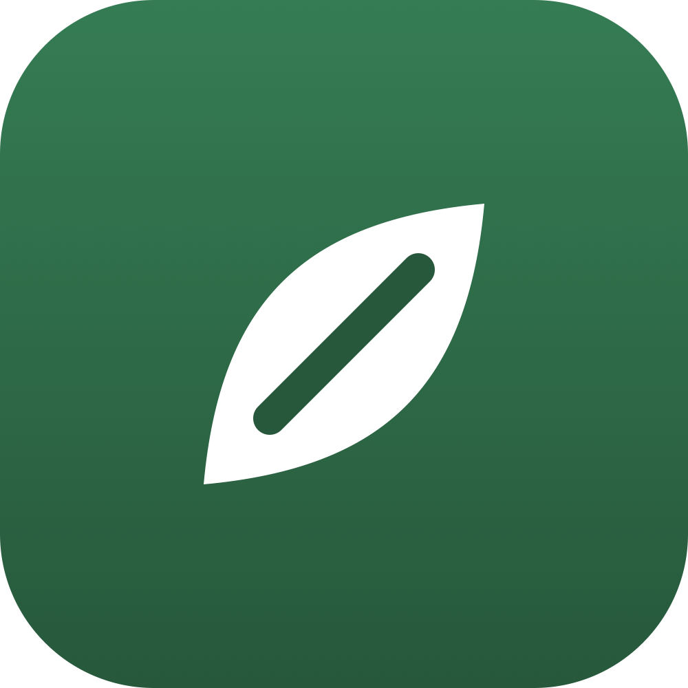

# DocToApp

**Convierte la plantilla de Word de un profesional de salud en una mini-app que su paciente llena desde el celular.**

[🌱 Demo en vivo](https://doctoapp.onrender.com) · Platanus Build Night — Ciudad de México

---

## Qué es

No todos hacen vibecoding. Psicólogos, nutriólogos y fisioterapeutas ya tienen sus
formatos en Word que entregan a sus pacientes. **DocToApp toma ese `.docx` y lo vuelve
una mini-app móvil, autocontenida y compartible por link** — sin que el profesional
escriba una línea de código ni un *prompt* inicial. Sube el archivo, confirma lo que la
IA detectó, y comparte.

## Cómo funciona (dos cerebros)

- **Orquestador — Claude Sonnet 4.6.** Conversa, muestra el esquema detectado (editable)
  y hace ≤3 preguntas para confirmarlo. Nunca lee el documento.
- **Motor de construcción — Claude Opus 4.8 (Managed Agent).** Lo único con la skill
  oficial `docx` + sandbox. **PARSE** → infiere el esquema intermedio; **BUILD** → escribe
  un `index.html` autocontenido (móvil-first, `localStorage`, acentos en español);
  **REFINE** por turnos sobre la misma sesión.

El paciente abre `/d/<slug>` y llena la herramienta desde el celular. Cuando un documento
se sale del catálogo (tablas, sub-escalas), el agente **propone** una representación en vez
de fallar en silencio.

## Stack

Next.js 16 (App Router) · Vercel AI SDK v6 · **Claude Managed Agents** (skills `docx`/`pdf`) ·
MongoDB · **Clerk** (auth, *fail-closed*) · Tailwind v4. Deploy en Render.

## Correr local

```bash
npm install
cp .env.example .env.local   # ANTHROPIC_API_KEY, MONGODB_URI, claves de Clerk
npm run dev
```

## Hacker

- Eduardo Velez Santiago ([@alusor](https://github.com/alusor))
